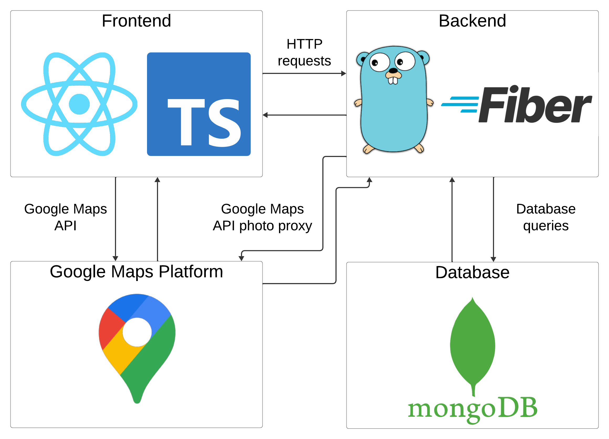

# Map Management Platform for Sharing Travel Experiences

A full-stack web application for creating, managing, and sharing personalized maps with favorite places. Users can explore locations, follow other users, and get personalized recommendations.

## Features
- Create and share interactive maps with your favorite places
- Find places using Google Maps integration and save them to your profile
- Follow users and explore their profiles 
- Recommendation engine for maps, places, and users

## Tech Stack
- **Frontend:** React.js, TypeScript, Chakra UI, Zustand, Vite
- **Backend:** Go (Fiber), RESTful API
- **Database:** MongoDB
- **APIs:** Google Maps API

##  Architecture



## Installation
### Prerequisites
- Node.js 18+
- Go 1.21+
- MongoDB (local or remote)
- Google Maps API Key (get it from [Google Cloud Console](https://developers.google.com/maps))


### Steps
```bash
# Clone repo
git clone https://github.com/vnpnko/Map-Management-Platform-for-Sharing-Travel-Experiences.git

# Frontend
cd client
npm install
npm run dev

# Backend
cd server
go run main.go
